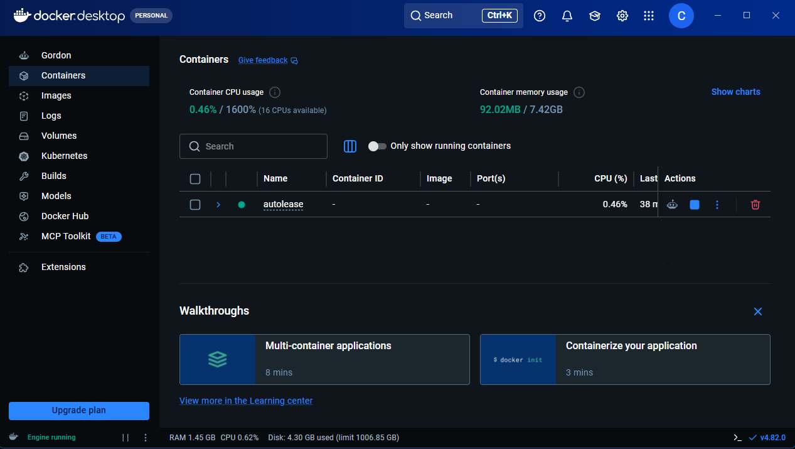
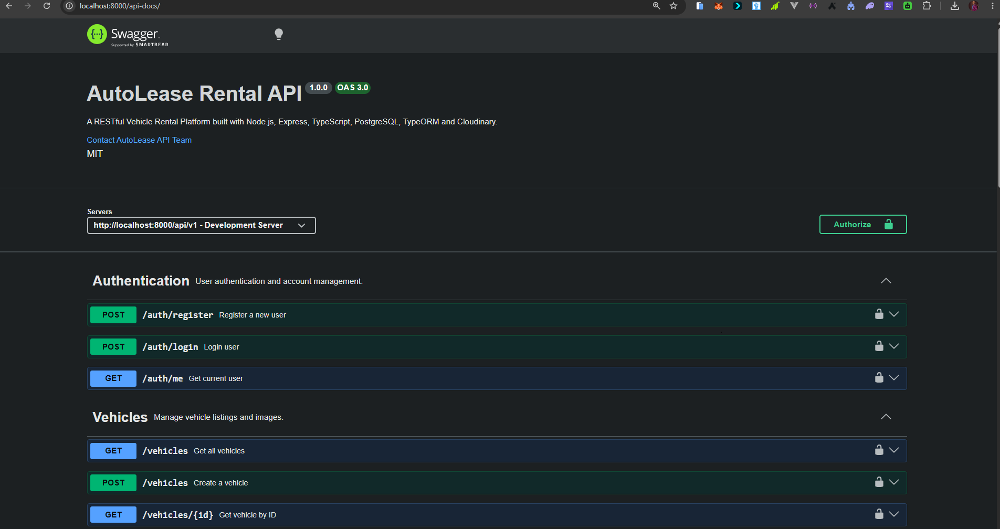

# final-backend-assement-on-techjaunt

# 🚗 AutoLease Backend API

A production-ready backend REST API for a modern vehicle rental marketplace built with **Node.js**, **Express**, **TypeScript**, **PostgreSQL**, **TypeORM**, and **Docker**.

The platform enables customers to rent vehicles, vehicle owners to manage listings and bookings, and administrators to oversee the entire marketplace through dedicated dashboards.

---

## ✨ Features

### 🔐 Authentication & Authorization

- JWT Authentication
- Refresh Token Support
- Role-Based Access Control (RBAC)
- Protected Routes
- Secure Password Hashing (bcrypt)

### 🚘 Vehicle Management

- Create Vehicle
- Update Vehicle
- Delete Vehicle
- Upload Vehicle Images (Cloudinary)
- Pagination
- Filtering
- Search

### 📅 Booking Management

- Create Booking
- Confirm Booking
- Cancel Booking
- Complete Booking
- Booking Status Management

### 💳 Payments

- Paystack Integration
- Payment Initialization
- Payment Verification

### ⭐ Reviews

- Create Reviews
- View Vehicle Reviews
- Delete Reviews

### ❤️ Favorites

- Add Vehicle to Favorites
- View Favorite Vehicles
- Remove Favorites

### 📊 Dashboards

#### Customer Dashboard

- Profile
- Bookings
- Payments

#### Owner Dashboard

- My Vehicles
- Bookings
- Revenue

#### Admin Dashboard

- Platform Statistics
- User Analytics
- Revenue Analytics

### 📖 API Documentation

- Swagger UI Documentation

### 🔒 Security

- Helmet
- CORS
- HPP Protection
- Rate Limiting
- Compression
- Environment Validation

### 🐳 DevOps

- Docker
- Docker Compose
- Redis
- PostgreSQL

---

## 🛠 Tech Stack

| Category         | Technology        |
| ---------------- | ----------------- |
| Runtime          | Node.js           |
| Framework        | Express.js        |
| Language         | TypeScript        |
| Database         | PostgreSQL        |
| ORM              | TypeORM           |
| Authentication   | JWT               |
| File Upload      | Multer            |
| Image Storage    | Cloudinary        |
| Payments         | Paystack          |
| Documentation    | Swagger (OpenAPI) |
| Cache            | Redis             |
| Containerization | Docker            |
| Logging          | Morgan + Winston  |

---

## 📁 Project Structure

```text
src
├── config
├── database
├── entities
├── middlewares
├── modules
│   ├── auth
│   ├── vehicles
│   ├── bookings
│   ├── payments
│   ├── reviews
│   ├── favorites
│   ├── owners
│   ├── customers
│   └── admin
├── utils
└── server.ts
```

---

## 🚀 Installation

### Clone the Repository

```bash
git clone https://github.com/YOUR_USERNAME/autolease-backend.git

cd autolease-backend
```

### Install Dependencies

```bash
npm install
```

### Configure Environment Variables

Create a `.env` file in the project root.

You can use `.env.example` as a template.

### Run Database Migrations

```bash
npm run migration:run
```

### Start Development Server

```bash
npm run dev
```

The API will be available at:

```
http://localhost:8000
```

---

## 🐳 Running with Docker


Build and start all services:

```bash
docker compose up --build
```

Run in detached mode:

```bash
docker compose up -d
```

Stop containers:

```bash
docker compose down
```

The Docker environment includes:

- AutoLease API
- PostgreSQL
- Redis

---

## 📖 API Documentation

Swagger UI is available after starting the application.

```
http://localhost:8000/api-docs
```

The below is for the runing swager

The below is for the runing api on postman

The documentation includes:

- Authentication
- Vehicles
- Bookings
- Payments
- Reviews
- Favorites
- Owner Dashboard
- Customer Dashboard
- Admin Dashboard

---

## 📦 API Modules

### Authentication

- Register
- Login
- Get Current User

### Vehicles

- Create Vehicle
- Get Vehicles
- Get Vehicle by ID
- Upload Vehicle Image
- Delete Vehicle

### Bookings

- Create Booking
- Confirm Booking
- Cancel Booking
- Complete Booking

### Payments

- Initialize Payment
- Verify Payment

### Reviews

- Create Review
- Get Reviews
- Delete Review

### Favorites

- Add Favorite
- Get Favorites
- Remove Favorite

### Customer Dashboard

- Dashboard
- Bookings
- Payments
- Profile

### Owner Dashboard

- Dashboard
- Vehicles
- Revenue
- Bookings

### Admin Dashboard

- Platform Statistics

---

## 🔒 Security Features

- JWT Authentication
- Role-Based Access Control (RBAC)
- Helmet Security Headers
- Rate Limiting
- HTTP Parameter Pollution (HPP) Protection
- Secure Password Hashing with bcrypt
- Environment Variable Validation
- CORS Configuration
- Global Error Handling

---

## 📜 Available Scripts

```bash
npm run dev
```

Starts the development server.

```bash
npm run build
```

Compiles the TypeScript project.

```bash
npm start
```

Runs the compiled application.

```bash
npm run migration:run
```

Runs database migrations.

```bash
npm run migration:revert
```

Reverts the last migration.

```bash
npm test
```

Runs the test suite.

---

## ⚙️ Environment Variables

The project uses environment variables for configuration.

Key variables include:

- JWT_SECRET
- JWT_REFRESH_SECRET
- DATABASE_HOST
- DATABASE_PORT
- DATABASE_USERNAME
- DATABASE_PASSWORD
- DATABASE_NAME
- CLOUDINARY_CLOUD_NAME
- CLOUDINARY_API_KEY
- CLOUDINARY_API_SECRET
- PAYSTACK_SECRET_KEY
- REDIS_HOST
- REDIS_PORT

See `.env.example` for the complete list.

---

## 🚀 Future Improvements

- Email Verification
- Forgot Password
- Password Reset
- Refresh Token Rotation
- GitHub Actions CI/CD
- Automated Testing (Jest & Supertest)
- Notifications
- Background Jobs (BullMQ)
- AWS S3 File Storage
- Kubernetes Deployment
- Monitoring & Metrics

---

## 👨‍💻 Author

**OKORIE CHIGOZIE**

Backend Developer

GitHub:
https://github.com/Chigybillionz

---

## 📄 License

This project is licensed under the MIT License.
